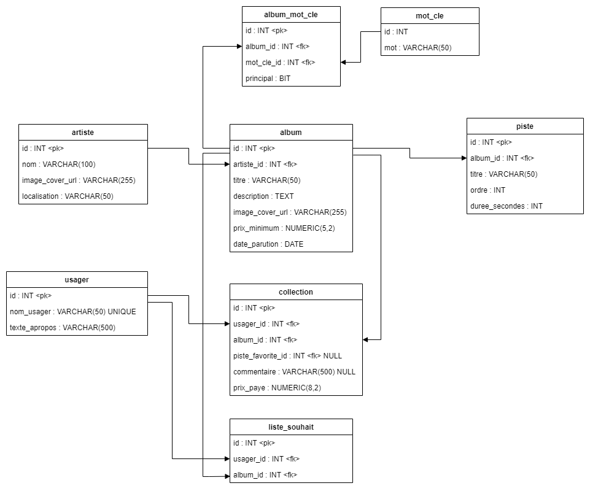
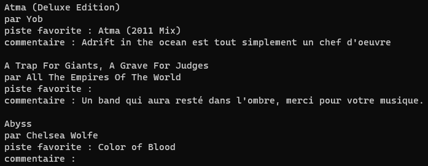

# Révision pour l'épreuve finale

## Directives

- Téléchargez le projet de départ : [revision_finale.zip](../ressources/revision_finale.zip)
- Importez le script SQL **creationBD.sql** présent dans le répertoire *ressources* du projet.

Diagramme de classe de la base de données importée

{.center .shadow}

Le projet contient deux scripts Python: **app.py** qui est le programme principal et **db_groupCamp.py** qui contient des fonctions qui interroge la base de données.

Au lancement de app.py on vous demandera de saisir un nom d'usager. Il y a trois usagers valides à la création de la base de données : **Math**, **CharlyBoy** et **Loulou**. Ensuite le menu suivant est affiché : 

{.center .shadow}

## Question #1 - Déclencheurs

Créez un script SQL qui va ajouter des déclencheurs (Trigger) qui permettront de s'assurer que la piste favorite que l'usager entre pour un album de sa collection est bien présente dans cet album. 

Si la piste qui est indiqué est invalide, annulez l'insertion ou la modification et retournez le message d'erreur "La piste favorite indiquée n'est pas présente dans cet album" avec le code d'erreur **SQLSTATE "45000"**. 

Utilisez **SIGNAL** pour le retour d'information de l'erreur.

Le script SQL à remettre doit se nommer NomPrenom_creationTrigger.sql et se retrouver dans le répertoire *ressources*.

## Question #2 - Afficher le résultat d'une requête

Complétez la section ==Afficher ma collection== du script *app.py*.

À partir de l'usager qui est connecté, affichez la liste des albums qui sont dans sa collection. Pour chaque album, affichez les informations suivantes sur des lignes différentes: 

- Le titre de l'album
- "par" et le nom du groupe
- "piste favorite : " et le titre de la piste favorite. S'il n'y en a pas, affichez "-"
- "commentaire : " et le commentaire donné à l'album. S'il n'y en a pas, affichez "-"

Exemple de résultat pour la collection de l'usager "Math"

{.center .shadow}

## Question #3 - Procédure stockée

Complétez la section ==ajouter un album à ma collection== du script *app.py*.

Vous devez créer une procédure stockée nommée **AjouterAlbum** qui va prendre en paramètre les informations suivantes : 

- Le id de l'usager
- Le id de l'album à ajouter (on prend pour acquis que l'usager va connaître le id de l'album)
- Le id de la piste favorite de l'album
- Un commentaire sur l'album
- Le prix payé pour l'album.

Dans la procédure stockée, vous devez faire les instructions suivantes : 

- Déclarez un "exit handler" pour le code SQLSTATE '99999' qui va annuler la transaction et retourner le texte "Le prix payé est inférieur au prix minimum de l\'album." dans une requête SELECT.
- Déclarez un "exit handler" pour les "SQLEXCEPTION" qui va annuler la transaction et retourner le texte "Une erreur est survenue, les opérations ont été annulées." dans une requête SELECT.
- Englobez toutes les instructions dans une transaction
- Validez si le prix payé est supérieur ou égal au prix demandé pour l'album. S'il est inférieur, lancez l'exception SQLSTATE '99999' avec l'instruction SIGNAL.
- Insérez les informations requises dans la table collection
- Si l'album acheté était déjà présent dans la liste de souhait de l'usager, le supprimer de la liste
- Si toutes les opérations ont réussi, retournez le texte "L\'ajout de l\'album a réussi" dans une requête SELECT.

Ensuite dans le script Python, demandez les informations à l'usager et lancez la procédure stockée. Récupérez le résultat (le message de retour du SELECT dans la procédure) et affichez-le à l'écran.

**Ajoutez un script SQL nommé NomPrenom_ajouterAlbum.sql dans le répertoire ressources du projet qui permettra de recréer votre procédure stockée.**

Exemple de résultat pour l'usager "Math"

{.center .shadow}

{.center .shadow}

{.center .shadow}