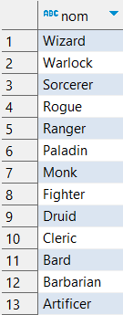
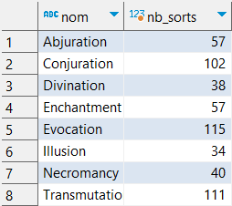
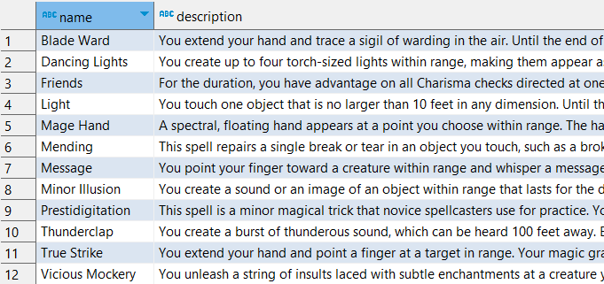
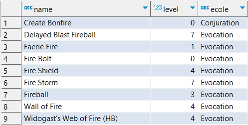
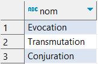
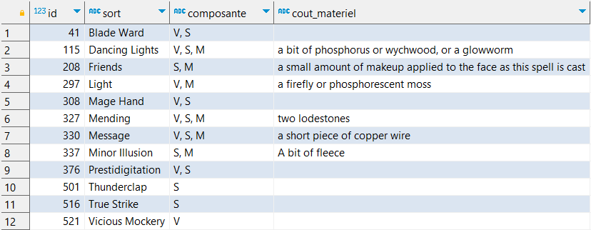

# Exercice 1 - Révision

Pour se remettre dans le bain des bases de données, voici un petit exercice qui récapitule les concepts abordés durant le cours de Base de données 1. Veuillez inscrire dans un fichier SQL toutes les commandes et requêtes que vous avez utilisées pour répondre aux questions de la section **Manipulation des données**. Ce fichier doit être soumis via le devoir Teams correspondant.

**Contexte de l'exercice :**

La base de données utilisée pour cet exercice contient une liste de sorts du jeu Donjons et Dragons, 5e édition. Chaque sort est associé à une unique école de magie mais peut être utilisé par plusieurs classes de personnages. La base de données inclut également une liste d'utilisateurs qui peuvent créer et gérer une liste de leurs sorts favoris.

**Diagramme de classes de la base de données :**

**Création d'une base de données et exécution d'un script SQL**

- Téléchargez le fichier [**ex01_create_tables.sql**](../ressources/ex01_create_tables.sql). 
- Lancez le script pour créer la base de données, les tables et le contenu des tables.
- Allez-y en ligne de commande ou avec DBeaver

**Visualisation des résultats :**

Pour chaque question, une image illustrant le résultat attendu est fournie. Ces images montrent clairement le nom des colonnes désirées pour les résultats de vos requêtes. Assurez-vous de configurer vos requêtes pour que les résultats correspondent à ce format.

**Manipulation des données**

| Énoncé | Résultats attendus |
|--------|-------------------|
| 1. Sélectionnez le nom de toutes les classes. Triez le résultat en ordre alphabétique inversé. |  |
| 2. Comptez le nombre de sorts qui appartient à l'école **Conjuration**. |  |
| 3. Comptez le nombre de sorts de chacune des écoles. (ecole - nb_sorts) |  |
| 4. Sélectionnez la liste des sorts de la classe **Bard** de niveau 0, triez en ordre alphabétique de nom de sort. |  |
| 5. Sélectionnez la liste de tous les sorts qui contiennent le mot **fire** dans leur nom. |  |
| 6. Trouvez les trois écoles de magie qui comptent le plus de sorts faisant partie des sorts favoris des usagers. Triez les écoles en commençant par la plus populaire. |  |
| 7. Sélectionnez la liste des sorts qui ont le composant **verbal** mais pas **somatic** et **material** et qui ont une durée d'une heure OU qu'ils n'ont pas le composant **verbal** et qui ont une portée de **Touch** |  |
| 8. Sélectionnez le nombre de sorts pour chaque classe. |  |
| 9. En vous aidant de la requête précédente, affichez la moyenne de sort par classe de personnage. Essayez d'utiliser une sous-requête et la fonction SQL **AVG** |  |
| 10. Sélectionnez tous les sorts d'une classe et d'un niveau donnés. Pour chaque sort, affichez l'ID et le nom du sort, ainsi qu'une colonne "composante" qui sera générée comme suit : pour les champs **verbal**, **somatic**, et **material**, affichez respectivement "V", "S", ou "M" si la valeur est égale à 1 ; sinon, n'affichez rien. Chaque lettre doit être séparée par une virgule. Enfin, affichez la valeur du champ **material_cost**. Vous pouvez utiliser les fonctions **IF()** et **CONCAT()** pour vous aider. Par exemple, affichez tous les sorts de la classe Bard de niveau 0. |  |
