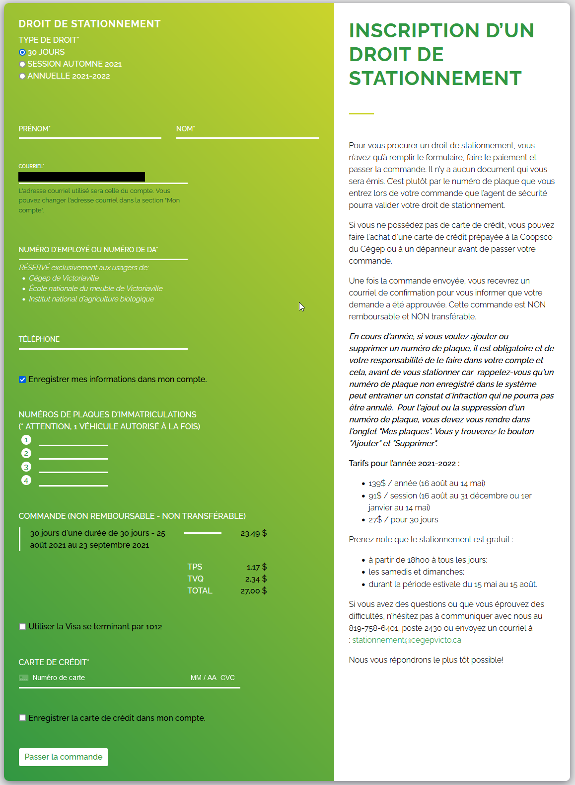

# Exercice 03 - Analyse du système de stationnement du cégep

## Objectif

Dans cet exercice, nous allons analyser le système de gestion des droits de stationnement du cégep. Votre mission est d’étudier ce système et de concevoir deux types de diagrammes à l’aide d’un logiciel spécialisé :

- Schéma Conceptuel : Utilisez le modèle entité-association pour ce schéma.
- Diagramme de Classe UML.

Après avoir créé ces diagrammes, vous devrez les soumettre sous forme d’images via la plateforme Teams, dans la section dédiée aux devoirs.

## Mise en situation

### Création de Compte

Pour commencer, un utilisateur doit créer un compte en fournissant son adresse courriel et un mot de passe.

### Commande de Droits de Stationnement

Une fois le compte créé, l’utilisateur peut commander un droit de stationnement. Les étapes incluent :

- La sélection de la durée du droit de stationnement.
- La spécification des véhicules autorisés, identifiés par leurs plaques d’immatriculation.

### Options de Durée

Les utilisateurs peuvent choisir parmi les durées suivantes :  

- 30 jours
- 1 session
- Annuel

### Gestion des Plaques d’Immatriculation
- Un maximum de 4 plaques d’immatriculation peut être enregistré par commande.
- Bien qu’un compte puisse être associé à plus de 4 plaques, chaque plaque est liée à une commande spécifique et, par conséquent, à un droit de stationnement déterminé.

Pour plus de détails, veuillez consulter les images fournies ci-dessous. :

{.center .shadow}

{.center .shadow}

Dans la section *Informations personnelles*, on retrouve le numéro de DA ou d'employé, le nom complet, le courriel et le numéro de téléphone.

{.center .shadow}

{.center .shadow}

{.center .shadow}

{.center .shadow}