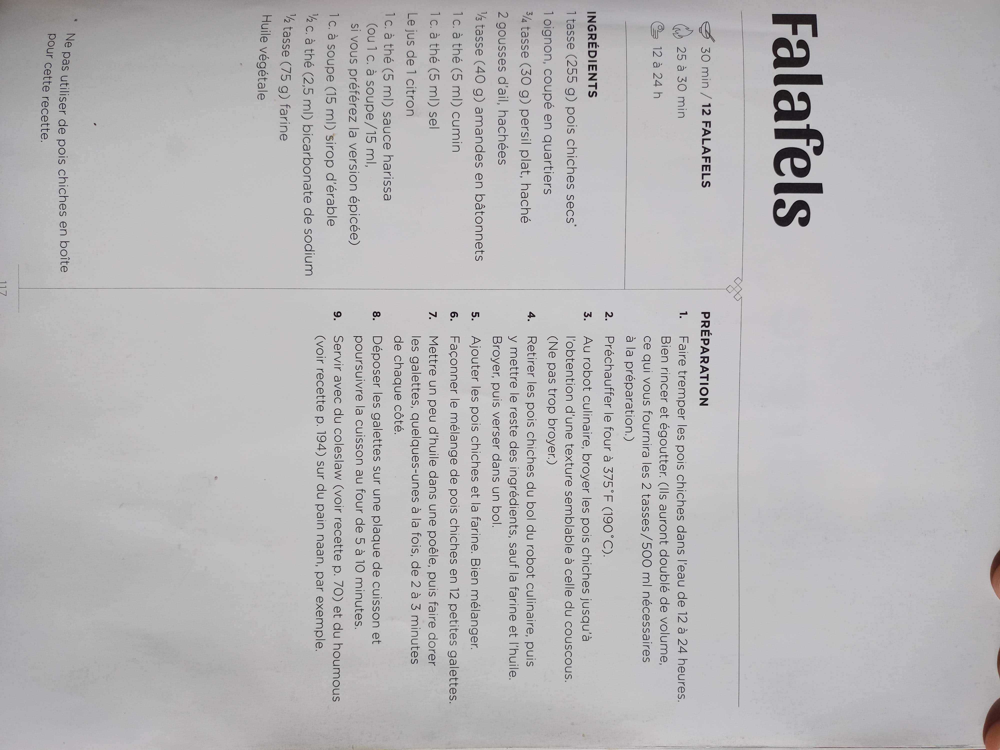

# Exercice 04 - Modélisation d'un livre de recettes

## Consignes

Vous devez analyser et modéliser un livre de recettes. Les deux images qui suivent vous indique ce qui doit être inclus dans la base de données. **<u>Toutes les informations</u>** présentent doivent être sauvegardées.

Précision sur les pictogrammes dans les recettes : 

- Le bol représente le temps de préparation de la recette
- La flamme est le temps de cuisson
- La main est un temps de préparation autre

Vous devez me produire et remettre : 

- [ ] Le modèle entité-association en format image.
- [ ] Un diagramme de classes UML, aussi à remettre en format image.
- [ ] Un script sql de génération de la base de données et des tables qui inclus la création de la base de données, des tables et des clés primaires et étrangères.
- [ ] La base de données doit se nommer **ex04_recette** et avoir comme collation `utf8mb4_unicode_ci`
- [ ] La table qui contiendra les recettes doit avoir une clé primaire qui débute à la valeur 1000
- [ ] Le script doit pouvoir être lancé consécutivement sans causer d'erreur (Pensez à ajouter des commandes **drop ... if exists**)
- [ ] Vous devez respecter les trois première forme normale et la convention de nommage qui est décrite dans les notes de cours.

Le tout dans un dossier compressé dans le devoir sur Teams

## Images

### Recette 1

{.center .shadow}

### Recette 2

{.center .shadow}
