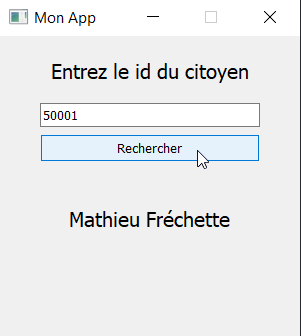

# Exercice 13 - pyQt5

À l'aide de la librairie pyQT5 et de la base de données credit_social, créez une interface graphique qui permettra de saisir un id de citoyen et de retourner son nom.

## Résultat

{.center .shadow}

- On entre un id dans le textBox.
- En cliquant sur rechercher, on effectue une requête à la base de données.
- On affiche le nom du citoyen sous le bouton.

## Exemple de code

L'exemple de code suivant va afficher une fenêtre vide.

``````python
# Pour pouvoir passer des arguments à notre application
import sys
# Les librairies PyQT5
from PyQt5.QtCore import *
from PyQt5.QtWidgets import *
from PyQt5.QtGui import *

class MainWindow(QMainWindow):

    def __init__(self):
        super(MainWindow, self).__init__()

        self.setWindowTitle("Oh la belle fenêtre vide")
        self.setFixedSize(QSize(600, 300))

# Une instance de QApplication, on doit en avoir absolument 
# une et seulement une par application 
app = QApplication(sys.argv)

# Création de notre fenêtre principale en appelant la fonction
# MainWindow appelé plus haut
window = MainWindow()
# Très important de l'afficher car par défaut elle est masqué.
window.show()

# Démarre la boucle d'évènement. L'application va s'afficher.
app.exec()
``````

Exemple d'un classe MainWindows avec un bouton et un champ texte. Il y a un événement sur le bouton pour appeler une fonction quand on le clique.

``````python
class MainWindows(QMainWindow):
    def __init__(self):
        super().__init__()

        self.setWindowTitle("Mon App")
        self.setFixedSize(QSize(300, 300))

        # On crée un widget qui va contenir les autres et on 
        # défini le type de layout à utiliser
        layout = QGridLayout()

        # On crée un bouton avec le texte rechercher
        bouton = QPushButton('Rechercher')
        # On ajoute le bouton au widget layout 
        # à la position 2,0 (troisième ligne, première colonne)
        layout.addWidget(bouton, 2, 0)

        # On crée un widget label
        self.resultat = QLabel('-')
        # Formatage du texte
        self.resultat.setAlignment(Qt.AlignCenter)
        font = self.resultat.font()
        font.setPointSize(12)
        self.resultat.setFont(font)
        self.resultat.setFixedHeight(100)
        # On ajoute le label dans le layout
        layout.addWidget(self.resultat, 3, 0)

        # On associe l'événement clic du bouton à la fonction 
        # afficher_nom
        bouton.clicked.connect(self.afficher_nom)

        # On crée un container qui représente le widget principal, 
        # tout le contenu de notre fenêtre
        container = QWidget()
        # On y ajoute le widget layout
        container.setLayout(layout)
        # On défini le container comme le widget principal
        self.setCentralWidget(container)

    def afficher_nom(self):
        self.resultat.setText('Mathieu Fréchette')
``````