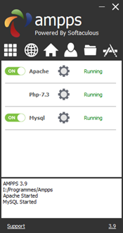

# Bases de données 2

# Cégep de Victoriaville

# Bases de données 2 (420-3B4-VI) - Automne 2024

## Introduction
Vous trouverez ici les notes et exercices du cours. J'ajouterai du nouveau contenu continuellement.

**Préalable à ce cours** : 420-2B4-VI Bases de données 1

**Ce cours est préalable à** :  
-  420-4C4-VI : Mégadonnées (efficacité des traitements sur de grands ensembles et base de données NoSQL)   
-  420-4B4-VI : Conception de systèmes (modélisation et analyse)  

**Cheminement complet**: [https://techinfo.profinfo.ca/grille/](https://techinfo.profinfo.ca/grille/)

## Environnement de travail

Afin d’utiliser MySQL vous devez installer deux logiciels :

* AMPPS, qui contient MySQL Server (installé aussi dans le cours de bases de données 1)
* DBeaver, un outil de gestion de base de données

### AMPPS
AMPPS est une pile Apache (Apache, MySQL, Php, Perl et d’autres) disponible à [https://ampps.com/](https://ampps.com/)

*Note* : si vous avez une erreur en lien avec « Microsoft c++ redistributable », lisez les détails de l’erreur. S’il est indiqué qu’une autre version est déjà installée, c’est probablement une version plus récente, ce qui est sans conséquence.

Une fois installé, vous n’avez qu’à le lancer pour voir apparaître cette petite fenêtre au bas à droite de votre écran. Le statut de MySQL devrait être vert (ça peut prendre quelques secondes après le démarrage pour passer du rouge au vert, c’est normal).

Note: si vous voulez, vous pouvez configurer AMPPS pour qu'il démarre automatiquement à l'ouverture de votre session Windows. Sinon vous devrez le démarrer manuellement.
