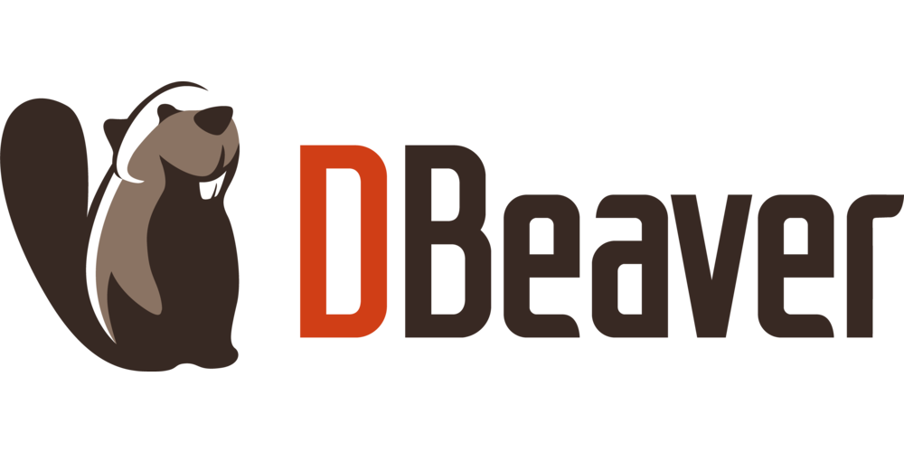

# DBeaver

DBeaver est un outil de gestion de base de données que nous utiliserons pour le cours. Il est gratuit, multiplateforme et supporte beaucoup de type de base de données. 

- Téléchargez l'installateur ici : [https://dbeaver.io](https://dbeaver.io/){target=_blank}

## Créer une connexion vers devilbox avec DBeaver

Vous devez tout d'abord vous assurer que les containeurs Devilbox sont bien lancés. Ensuite dans DBeaver cliquez sur le bouton *Nouvelle connexion* en haut à gauche

{.center .shadow}

Sélectionnez ensuite MariaDB dans la liste des type de connexion

{.center .shadow}

Si vous n'avez pas changé les configurations de Devilbox, vous pouvez laisser les informations par défaut, sinon entrez le bon mot de passe.

{.center .shadow}

Cliquez ensuite sur *Connection details* et entrez un nom significatif à votre connexion.

{.center .shadow}

Cliquez sur *Test de la connexion...*, on vous demandera de télécharger le driver pour MariaDB, acceptez et une fois terminé vous devriez avoir un message de succès. Cliquez sur *Finish* et votre connexion va s'ajouter dans le panneau à gauche.

{.center .shadow}
