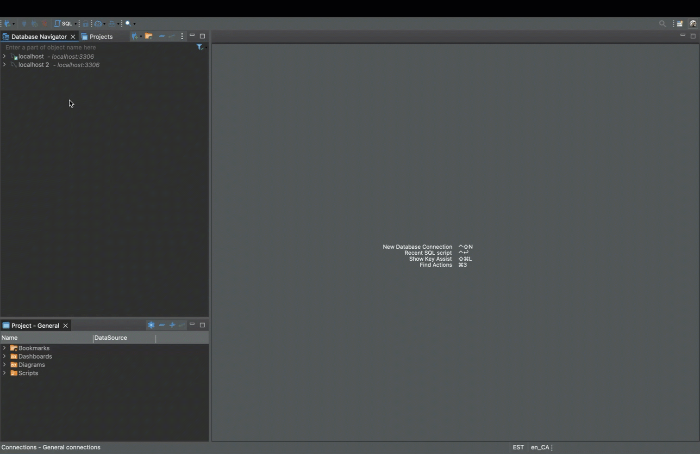

# DBeaver

DBeaver est un outil de gestion de base de données que nous utiliserons pour le cours. Il est gratuit, multiplateforme et supporte beaucoup de type de base de données. 

- Téléchargez l'installateur ici : [https://dbeaver.io](https://dbeaver.io/){target=_blank}

## Créer une connexion vers mysql avec DBeaver

Vous devez tout d'abord vous assurer que AMPPS est bien lancé. 

1. Ouvrez DBeaver
2. Cliquez sur *Database* -> *New Database Connection*
3. Sélectionnez *MySQL* dans la liste
4. Cliquez sur *Next*
5. Dans le champ *Host* entrez `localhost`
6. Dans le champ *Port* entrez `3306`
7. Dans le champ *Database* entrez `mysql`
8. Dans le champ *User name* entrez `root`
9. Dans le champ *Password* entrez `mysql`
10. Cliquer sur *Test Connection* pour vérifier que la connexion fonctionne
11. Cliquez sur *Finish*

